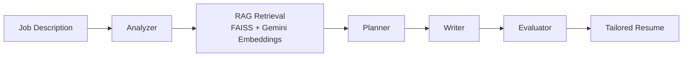

# ResumeTailor

An AI-powered resume tailoring system that reads a job description, retrieves grounded evidence from a personal knowledge base using RAG, and generates a targeted resume. Every bullet is backed by real experience or projects, so it tailors without fabricating.

## How it works

ResumeTailor runs a multi-stage pipeline:



| Stage | Responsibility |
|---|---|
| **Analyzer** | Parses the job description into a job title and a list of structured requirements, each with a `category` (e.g. `ai_ml`, `programming`, `location`) and `priority` (e.g. `required`, `preferred`). |
| **RAG Retrieval** | For each requirement, queries a FAISS vector store built from the candidate's knowledge base. Also runs a broad candidate-wide query so that relevant background isn't missed. |
| **Planner** | Decides which evidence goes into which resume section and which requirements to emphasize. |
| **Writer** | Generates resume content from the plan, using only the retrieved evidence. |
| **Evaluator** | Checks the output against the job requirements (including non-evidence requirements such as location) and flags gaps. |

### Metadata-aware evidence

Each knowledge-base document is tagged with metadata based on its folder, so the pipeline knows *what kind* of evidence a chunk represents, not just its text. This prevents errors like placing a professional role under Projects.

| Folder | `document_type` | Extra metadata | Target resume section |
|---|---|---|---|
| `knowledge_base/experience/` | `professional_experience` | `organization`, `role` | Professional Experience |
| `knowledge_base/projects/` | `project` | `project_name` | Projects |
| `knowledge_base/resume/` | `master_resume` | — | General candidate context |
| anything else | `other` | — | — |

A retrieved evidence item looks like this:

```json
{
  "requirement": "LangChain",
  "category": "ai_ml",
  "priority": "required",
  "document_type": "professional_experience",
  "source": "experience1",
  "organization": "Company name",
  "role": "AI Engineer",
  "content": "..."
}
```

## Tech stack

- **Python** with **FastAPI** for the backend API
- **LangChain** (`langchain-community`, `langchain-text-splitters`) for document loading, chunking and retrieval
- **FAISS** as the local vector store
- **Google Gemini** (`gemini-embedding-001`) for embeddings via `langchain-google-genai`, and Gemini models for the LLM stages
- **python-dotenv** for configuration

## Project structure

```
ResumeTailor/
└── backend/
    ├── .env                          # GOOGLE_API_KEY (not committed)
    ├── knowledge_base/               # Candidate evidence (Markdown)
    │   ├── experience/
    │   │   ├── experience1.md
    │   │   ├── experience2.md
    │   │   ├── experience3.md
    │   │   └── experience4.md
    │   ├── projects/
    │   │   ├── project1.md
    │   │   └── project2.md
    │   └── resume/
    │       └── master_resume.md
    ├── rag/
    │   ├── vector_store.py           # Loads docs, attaches metadata, builds FAISS index
    │   ├── retriever.py              # get_retriever()
    │   └── evidence.py               # retrieve_evidence(job_analysis)
    ├── vector_store/                 # Generated FAISS index (rebuild, don't edit)
    └── ...                           # Analyzer, planner, writer, evaluator, API app
```

<!-- TODO: update the last line with the actual file names/paths for the analyzer, planner, writer, evaluator and FastAPI app. -->

## Setup

These commands are for Windows PowerShell. On macOS/Linux, use `source .venv/bin/activate` instead of the activate script.

### 1. Create a virtual environment

```powershell
cd ResumeTailor\backend
python -m venv .venv
.venv\Scripts\Activate.ps1
```

### 2. Install dependencies

```powershell
pip install -r requirements.txt
```

If you don't have a `requirements.txt` yet, the core packages are:

```powershell
pip install fastapi uvicorn python-dotenv langchain-community langchain-text-splitters langchain-google-genai faiss-cpu
```

### 3. Configure environment variables

Create `backend/.env`:

```env
GOOGLE_API_KEY=your_google_api_key_here
```

### 4. Build the vector store

```powershell
python rag\vector_store.py
```

Expected output:

```
Loaded N documents from knowledge base.
Split documents into N chunks.
Created FAISS vector store.
Vector store saved locally at: ...\backend\vector_store
```

Rebuild the index any time you add, edit or remove files in `knowledge_base/`, or change how metadata is assigned.

### 5. Run the API

```powershell
uvicorn main:app --reload
```

<!-- TODO: replace `main:app` with your actual module and app name if different. -->

Then send a job description to the `/tailor-resume` endpoint. The interactive API docs are available at `http://127.0.0.1:8000/docs`.

## Adding to the knowledge base

**New job or internship:** add a Markdown file to `knowledge_base/experience/`, then add a mapping for it in `get_document_metadata()` in `rag/vector_store.py` so it gets the correct `organization` and `role`:

```python
elif filename == "new_company":
    metadata["organization"] = "New Company Inc."
    metadata["role"] = "Software Engineer"
```

**New project:** add a Markdown file to `knowledge_base/projects/`. The project name is derived from the file name automatically (`my_project.md` → `My Project`).

Then rebuild the vector store (step 4).

Write knowledge-base files as detailed, factual notes: what you built, the tools you used, the scale and the measurable outcomes. The richer and more specific these files are, the better the retrieval and the tailored bullets.

## Testing retrieval

You can check that evidence comes back with the right metadata before running the full pipeline:

```python
from rag.evidence import retrieve_evidence

job_analysis = {
    "job_title": "AI Engineer",
    "requirements": [
        {"requirement": "RAG", "category": "ai_ml", "priority": "required"},
        {"requirement": "Python", "category": "programming", "priority": "required"},
    ],
}

for item in retrieve_evidence(job_analysis):
    print(item["requirement"], "|", item["document_type"], "|",
          item.get("organization") or item.get("project_name") or item["source"])
```

Run it from the `backend` directory so the `rag` package imports correctly.

## Privacy note

The `knowledge_base/` folder contains personal career information. If this repository is public, consider adding `knowledge_base/` to `.gitignore` and committing a `knowledge_base_example/` folder with sample files instead. Always keep `.env` out of version control:

```gitignore
.env
.venv/
vector_store/
__pycache__/
```

## Roadmap

- [x] Job description analyzer with categorized, prioritized requirements
- [x] FAISS vector store with Gemini embeddings
- [x] Metadata-aware documents (`professional_experience`, `project`, `master_resume`)
- [x] Structured evidence retrieval with duplicate filtering
- [ ] Planner enforces section placement from `document_type` (experience → Professional Experience, project → Projects)
- [ ] Guarantee every professional experience appears on the resume, even when retrieval scores are low
- [ ] One-page resume constraint (bullet and section budgets enforced by the planner and checked by the evaluator)
- [ ] `awards/` and `certifications/` document types
- [ ] Explicit display names for projects (e.g. `ImmigRAG-USA` instead of `Immigration Rag`)
- [ ] Handling for Gemini API rate limits and quotas


